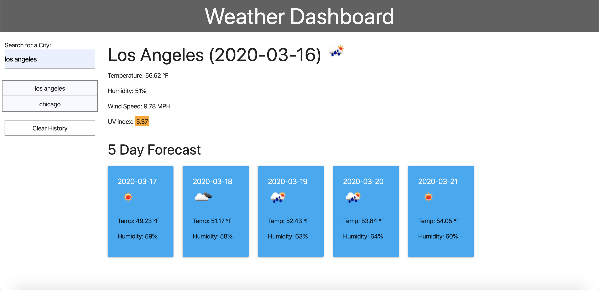

# weather-dashboard
 
## Summary
With the weather dashboard app, with the use of an API, the user can enter a city of his/her choosing to get the current weather and a five day forecast for that city. As the user enters more cities into the text area the cities are added into an array to be shown in the history tab so that the user may go back to review that city's weather. The search history will be added local storage so that if the user leaves the page, the history will still show up. The app has also has a response layout so that it looks well on moblie devices.

## Deployed App

Link to webpage: [weather dashboard](https://alex-bailon.github.io/weather-dashboard/)

Image of deployed app: 

## Conclusion
With the use of an API, I was able to successfully get information based on user input and display the users results. A future goal for this app will be to add some sort of toggle switch so that the user may go from degree fahrenheit to celsius. 